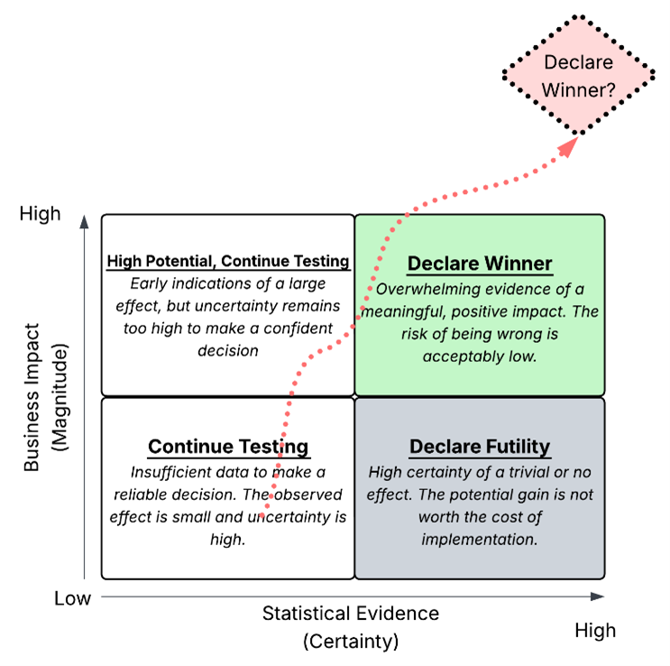
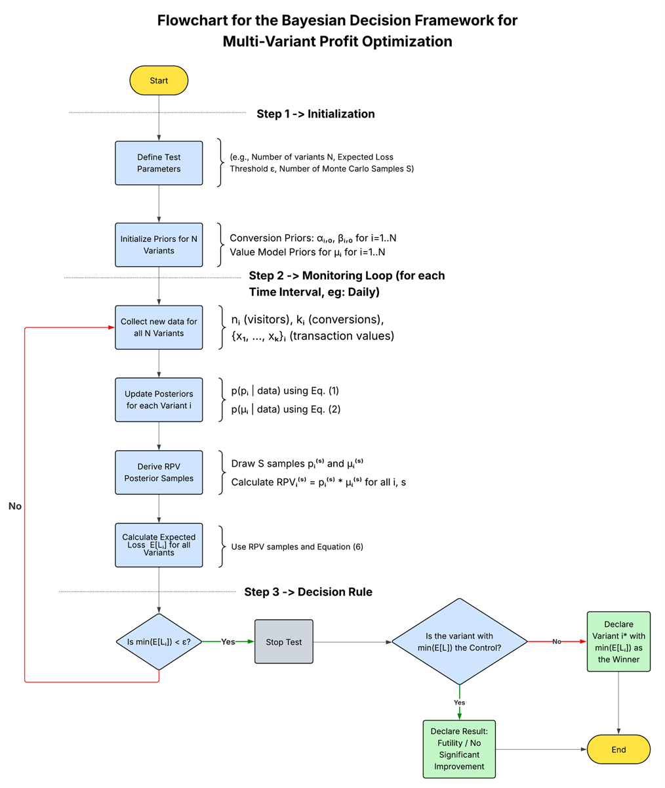

# Profit over Proxies: A Bayesian Framework for A/B/n Testing

[](https://opensource.org/licenses/MIT)

This repository contains the official Python simulation code for the research paper: **"Profit over Proxies: A Scalable Bayesian Decision Framework for Optimizing Multi-Variant Online Experiments."**

**Authors:** Srijesh Pillai, Rajesh Kumar Chandrawat  
**Status:** The paper is currently under review and has been prepared for submission.

---

## Abstract
> Online controlled experiments (A/B tests) are fundamental to data-driven decision-making. However, their application is frequently compromised by two shortcomings: the use of flawed heuristics like "p-value peeking," and an over-reliance on proxy metrics like conversion rates, which can lead to decisions that inadvertently harm business profitability. This paper addresses these challenges by introducing a comprehensive and scalable Bayesian decision framework designed for profit optimization in multi-variant (A/B/n) experiments. We propose a hierarchical Bayesian model that simultaneously estimates conversion probability and the monetary value of that conversion. Building on this, we employ a decision-theoretic stopping rule based on Expected Loss, enabling experiments to be concluded efficiently and safely.

---

## The Core Concept: A Smarter Decision Framework

Traditional A/B testing often forces a choice between speed (peeking at p-values) and rigor (fixed-horizon tests), and focuses on proxy metrics (like Clicks) instead of true business KPIs (like Revenue). Our framework resolves these conflicts by reframing the decision process around two key dimensions: **Statistical Evidence (Certainty)** and **Business Impact (Magnitude)**.

The goal is to move from the impulsive, high-risk "peeking" path to a deliberate, evidence-based decision to either declare a winner or declare futility.



---

## How to Reproduce the Paper's Simulation Studies

The entire simulation study presented in the paper is fully reproducible using the provided code.

### 1. Setup

First, clone this repository and navigate into the project directory:
```bash
git clone https://github.com/YOUR_USERNAME/profit-driven-bayesian-ab-testing.git
cd profit-driven-bayesian-ab-testing
```

Next, create a Python virtual environment and install the required dependencies:
```bash
# Create and activate a virtual environment (recommended)
python -m venv venv
source venv/bin/activate  # On Windows, use `venv\Scripts\activate`

# Install dependencies
pip install -r requirements.txt
```

### 2. Running the Simulations

The repository is organized into three main case studies from the paper, each with its own execution script. The core logic is contained within simulation_engine.py.

Case Study 1: The Revenue Trap (A/B Test)
This simulation demonstrates the framework's ability to avoid being fooled by a variant with a higher conversion rate but lower average order value, preventing a net financial loss.
```bash
python run_case_study_1.py
```

Case Study 2: The Clear Winner (A/B/C/D Test)
This tests the framework's power and efficiency in identifying a single, genuinely superior variant from a field of multiple options.
```bash
python run_case_study_2.py
```

Case Study 3: The Futility Test (A/B/C Test)
This tests the framework's ability to intelligently stop an experiment early when it becomes clear that no variant offers a practically significant improvement over the control.
```bash
python run_case_study_3.py
```

### 3. Framework Flowchart

The decision logic at the heart of the simulation_engine.py follows a principled, sequential process for each time interval (e.g., each day) of an experiment.


